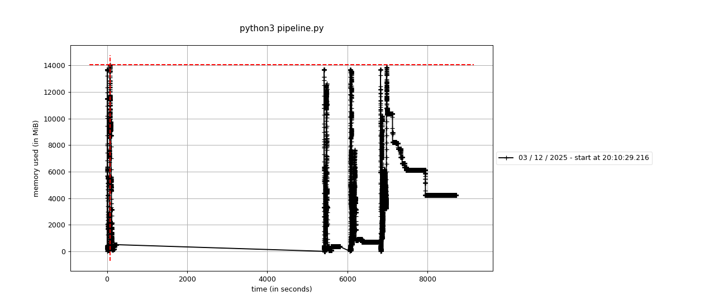
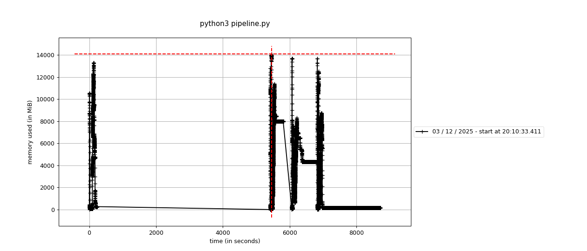
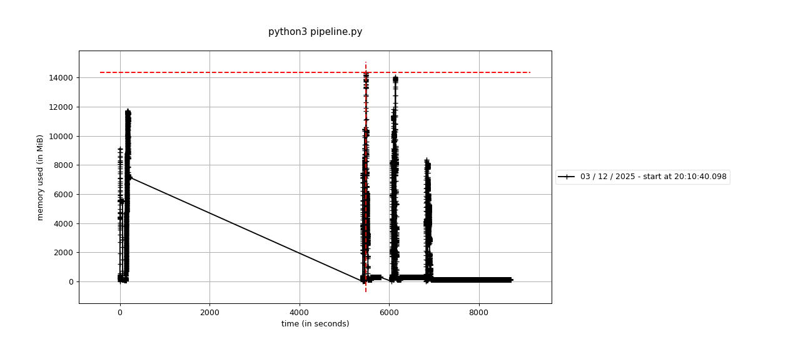

Implemented: 
- basic architecture
- Due to Mac silicon's segfault issue with FAISS search, these changes are made
    - single-time FAISS index loading
    - 1 FAISS thread when used on MacOS
- Support for Mac's mps and cuda

Command used to run node 0: TOTAL_NODES=3 NODE_NUMBER=0 \
NODE_0_IP=127.0.0.1:5000 \
NODE_1_IP=127.0.0.1:5001 \
NODE_2_IP=127.0.0.1:5002 \
BATCH_SIZE=4 \
BATCH_WAIT_SECONDS=1 \
mprof run -o node0.dat python3 pipeline.py

Command used to run node 1: TOTAL_NODES=3 NODE_NUMBER=1 \
NODE_0_IP=127.0.0.1:5000 \
NODE_1_IP=127.0.0.1:5001 \
NODE_2_IP=127.0.0.1:5002 \
BATCH_SIZE=4 \
BATCH_WAIT_SECONDS=1 \
mprof run -o node0.dat python3 pipeline.py

Command used to run node 2: TOTAL_NODES=3 NODE_NUMBER=2 \
NODE_0_IP=127.0.0.1:5000 \
NODE_1_IP=127.0.0.1:5001 \
NODE_2_IP=127.0.0.1:5002 \
BATCH_SIZE=4 \
BATCH_WAIT_SECONDS=1 \
mprof run -o node0.dat python3 pipeline.py

Command used to run client: NODE_0_IP=127.0.0.1:5000 python3 client.py
Batch size used: 4

Node 0 peak on given client.py: node0.dat      14046.844 MiB = 13.718 GiB

Node 1 peak on given client.py: node1.dat      14086.578 MiB = 13.756 GiB

Node 2 peak on given client.py: node0.dat      14355.453 MiB = 14.019 GiB

Benchmark results (Not updated yet)

batch_size=4
    Command used    : NODE_0_IP=127.0.0.1:5000 \python3 bench_client.py --num-requests 100 --concurrency 8 --label "batch_size=4"
    Total requests   : 100
    Concurrency      : 8
    Run label        : batch_size=4

    === Results ===
    Elapsed wall time : 1874.299 s
    Total requests    : 100
    Successful        : 100
    Failed            : 0

    Throughput:
    0.05 requests/second
    3.20 requests/minute

    Latency (successful requests only):
    Mean      : 146.868 s
    Median    : 152.147 s
    95th pct  : 155.514 s
    99th pct  : 155.562 s

    Peak Memory Usage:
    Node 0 : mprofile_20251127204100.dat      1.641 MiB
    Node 1 : mprofile_20251127204111.dat      1.828 MiB
    Node 2 : mprofile_20251127204112.dat      1.641 MiB
